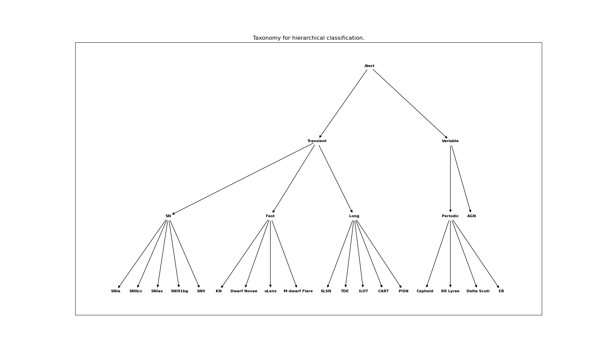
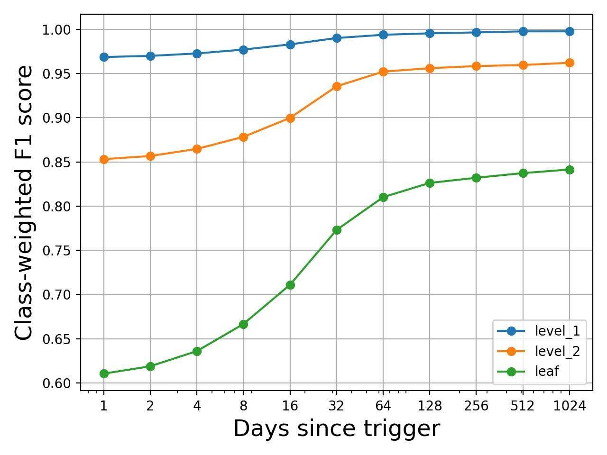
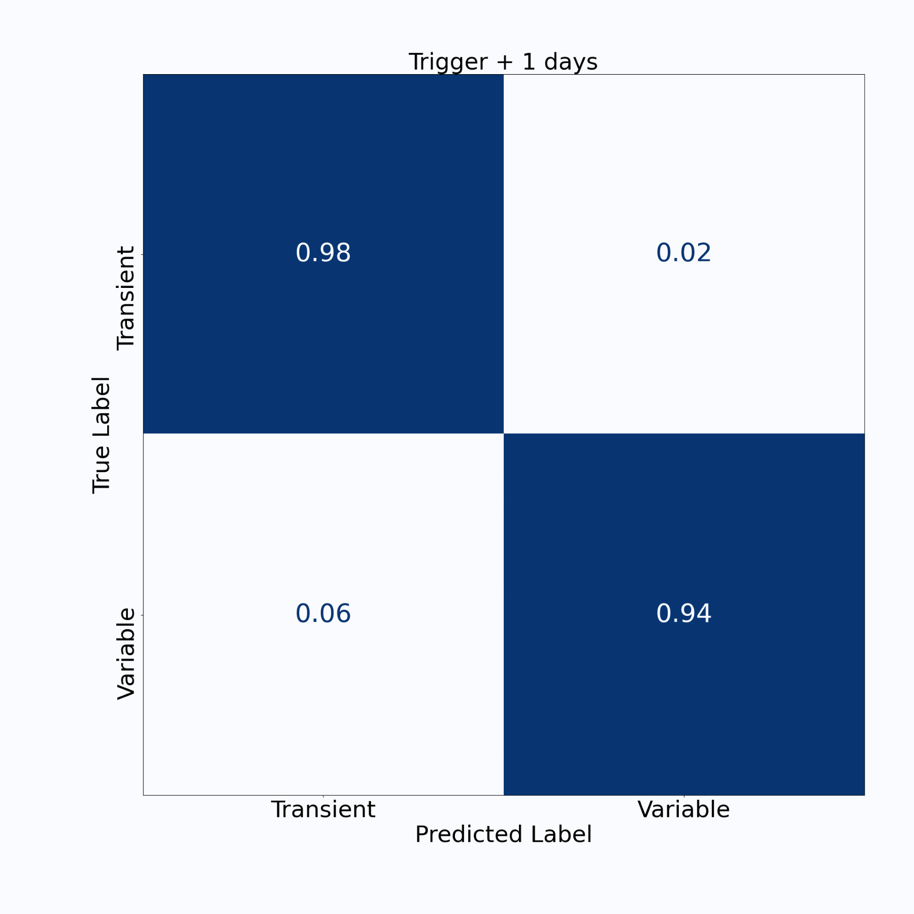
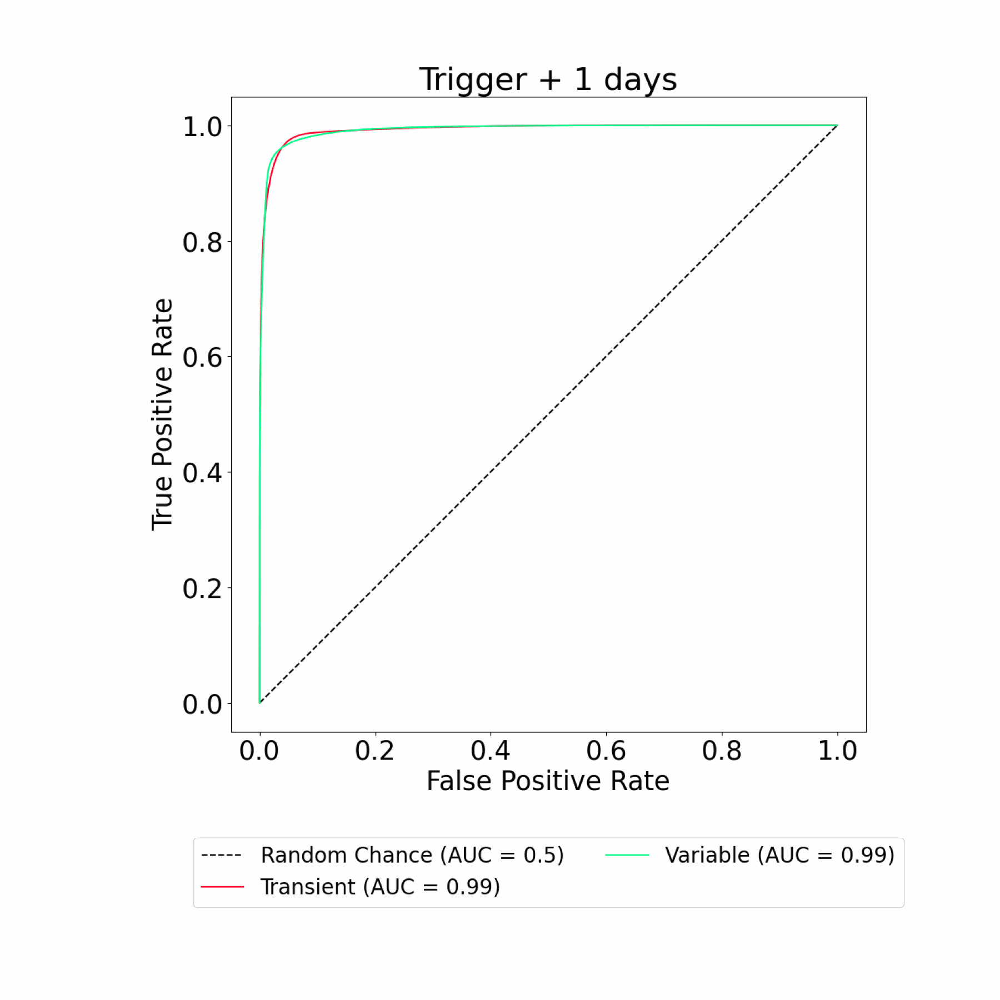
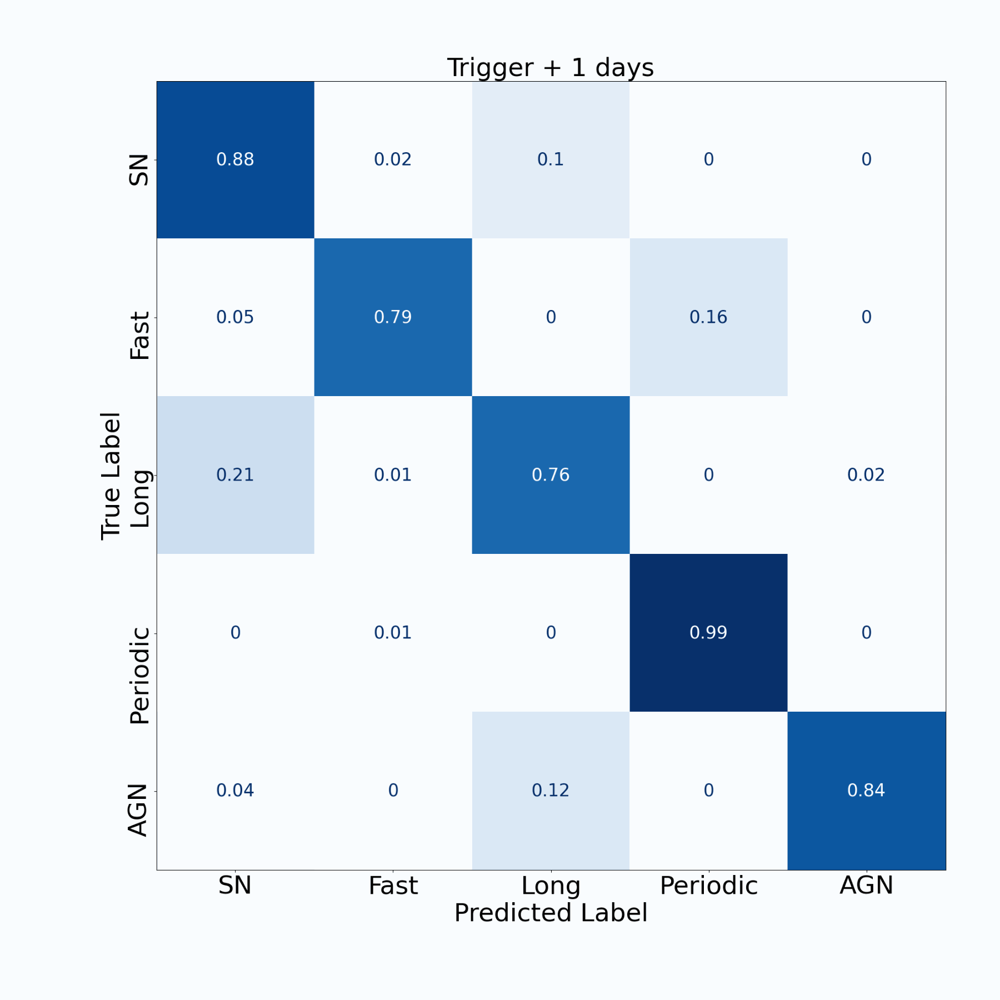
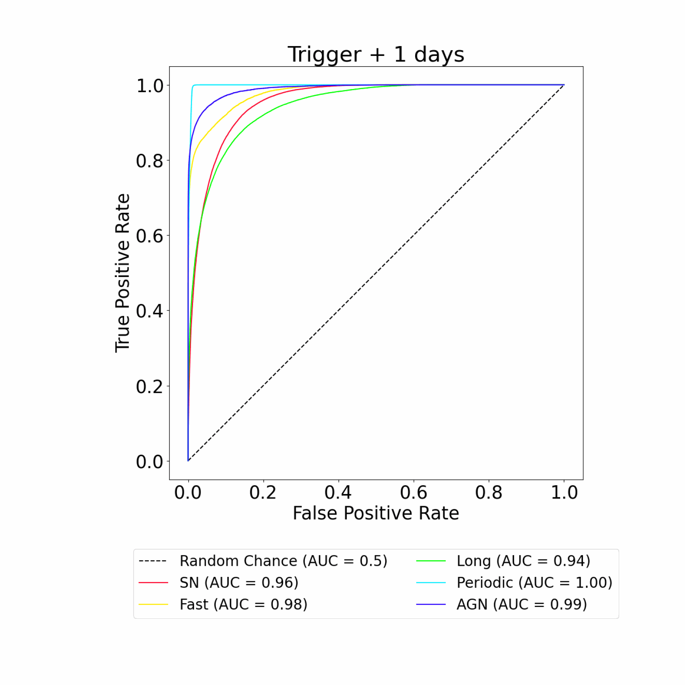
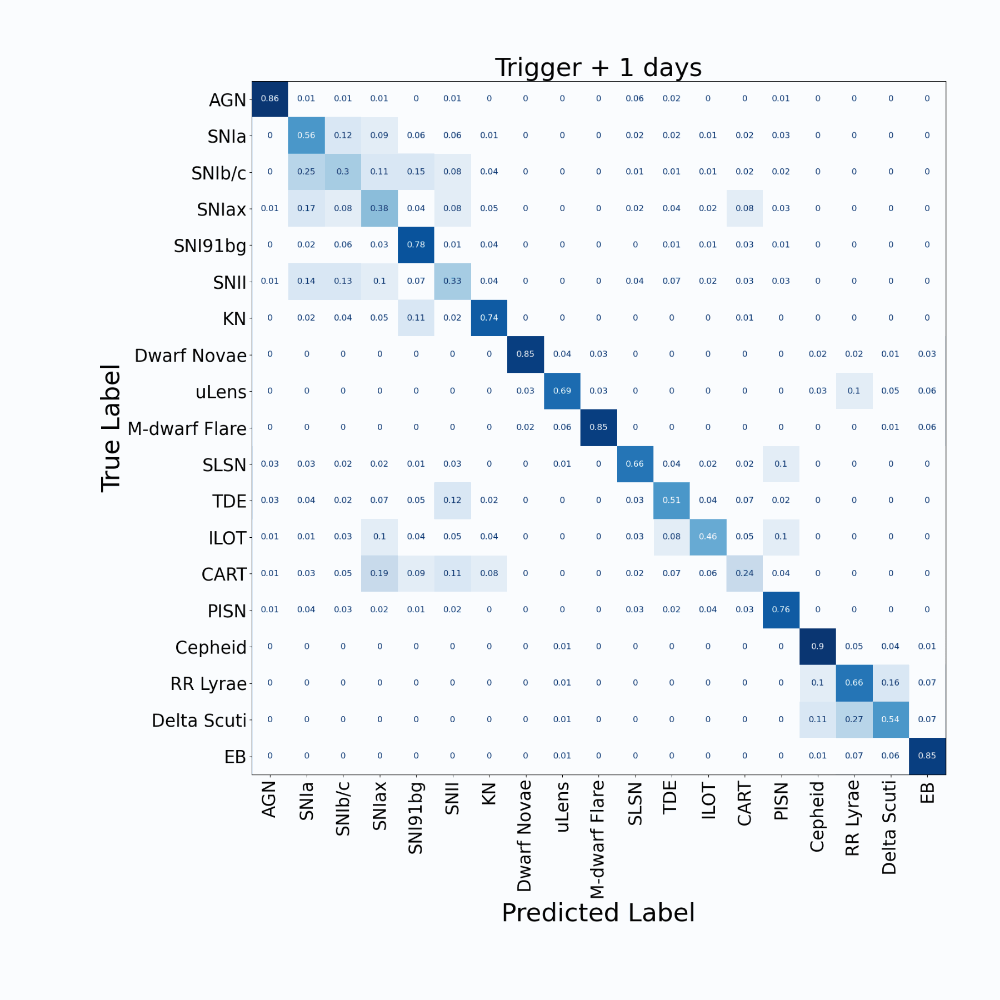
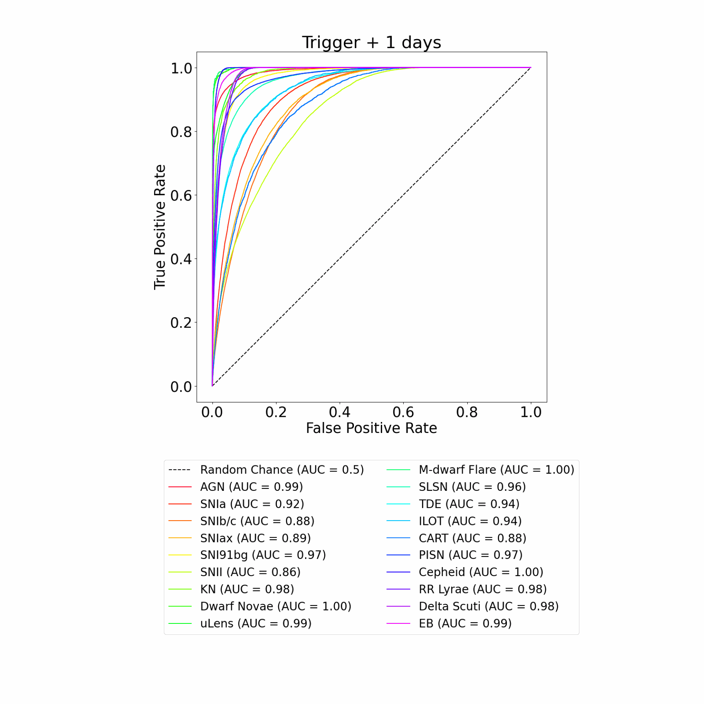

# ORACLE

We present ORACLE, the first hierarchical deep-learning model for real-time, context-aware classification of transient and variable astrophysical phenomena. ORACLE is a recurrent neural network with Gated Recurrent Units (GRUs), and has been trained using a custom hierarchical cross-entropy loss function to provide high-confidence classifications along an observationally-driven taxonomy with as little as a single photometric observation. Contextual information for each object, including host galaxy photometric redshift, offset, ellipticity and brightness, is concatenated to the light curve embedding and used to make a final prediction.

For more information, please read the our paper - https://ui.adsabs.harvard.edu/abs/2025arXiv250101496S/abstract

If you use any of this code in your own work, please cite the associated paper using the following 

```
@ARTICLE{2025arXiv250101496S,
       author = {{Shah}, Ved G. and {Gagliano}, Alex and {Malanchev}, Konstantin and {Narayan}, Gautham and {The LSST Dark Energy Science Collaboration}},
        title = "{ORACLE: A Real-Time, Hierarchical, Deep-Learning Photometric Classifier for the LSST}",
      journal = {arXiv e-prints},
     keywords = {Astrophysics - Instrumentation and Methods for Astrophysics, Astrophysics - High Energy Astrophysical Phenomena, Computer Science - Artificial Intelligence, Computer Science - Machine Learning},
         year = 2025,
        month = jan,
          eid = {arXiv:2501.01496},
        pages = {arXiv:2501.01496},
          doi = {10.48550/arXiv.2501.01496},
archivePrefix = {arXiv},
       eprint = {2501.01496},
 primaryClass = {astro-ph.IM},
       adsurl = {https://ui.adsabs.harvard.edu/abs/2025arXiv250101496S},
      adsnote = {Provided by the SAO/NASA Astrophysics Data System}
}
```


# General file descriptions:

* fits_to_parquet.py - Convert SNANA fits files to parquet files
* combine_parquet.py - Combine the parquet files into a training and testing set.
* LSST_Source.py - Class for storing relevant data from the parquet files. Has additional functionality for data augmentation, flux curve plotting etc.
* LSTM_model.py - Class for the LSTM classifier 
* train_LSTM_model.py - Script for training LSTM classifier
* class_summaries.py - Summarize the number of objects in each class and the length of the TS data for each of those objects
* dataloader.py - Convert the parquet rows to tensors. Augment the data with padding/truncation and transforms if necessary
* loss.py - Loss function for hierarchical classification
* taxonomy.py - Utility functions for the taxonomy used for this work

## Step 1 - Convert the data to a more usable form:

The ELAsTiCC 2 training data set contains 32 different classes of astrophysical objects. Each object has 80 FITS files - 40 which contain the photometry and the remaining contain other information like the host galaxy properties. 

We care about having all the information (i.e. light curves + host galaxy) information for each object in a convenient format before we start any data augmentation. For this reason, we bind the HEAD and PHOT FITS files, extract the relevant information and store it as parquets. 

The code used for this conversion is in `fits_to_parquet.py`. This code is modified from an earlier version written by Kostya [here](https://github.com/hombit/yad).

### Convert Elasticc 2 train dataset

- Download the data with [this link](https://portal.nersc.gov/cfs/lsst/DESC_TD_PUBLIC/ELASTICC/ELASTICC2_TRAINING_SAMPLE_2/ELASTICC2_TRAIN_02.tar.bz2)
- Unpack it to `data/data/elasticc2_train/raw`
- `cd data/data/elasticc2_train`
- Convert all the data to parquet: `ls raw | sed 's/ELASTICC2_TRAIN_02_//' | xargs -IXXX -P32 python3 ../../../fits_to_parquet.py raw/ELASTICC2_TRAIN_02_XXX parquet/XXX.parquet`

## Step 2 - Data Augmentation

The parquet files contain all of the information from the fits files, organized by source. However, we need to drop unnecessary features and augment our data before we can start training the models. 

We decompose the parquet rows into instances of the `LSST_Source` class (see LSST_Source.py). The features from the rows that are stored in the class are mentioned in the `time_series_features` and `other_features` lists (again, see LSST_Source.py).

While ingesting the parquet row data, we also pre process the light curve. For the processing, we do four things:

1. Remove saturations.
2. Keep the last non-detection before the trigger (if available).
3. Keep non-detection after the trigger and before the last detection (if available). 

We can plot these flux curves using the `LSST_Source.plot_flux_curve()` function. 

At this point, we have the `LSST_Source` object with all the data we need. However, all the light curves are full length. This is not realistic since real alerts will get objects with partial light curves. For this reason, we apply windowing to all the time series data in the original light curve. Thus, we create (potentially) multiple instance of the `LSST_Source` object with differing light curve lengths. We do this using pytorch transformations. It is important to note that all the other features (non time series) are shared between these augmented objects. 

## Step 3 - Building the Tensors

We are using pytorch for building our classification models so we convert all our LSST source objects into tensor representations. As an intermediate step, we combine the parquet files into a combined train parquet file and a combined test parquet file.

In order to do this, we use the following step(s):

- `python combine_parquet.py data/data/elasticc2_train/parquet/  data/data/elasticc2_train/train_parquet.parquet data/data/elasticc2_train/test_parquet.parquet`

This will store all the LSST sources, along with the associate photometry and host galaxy information in parquet files.

We use this representation to build tensors using the pytorch data loader to create two tensors for each event. One of them is a `(sequence_length, n_ts_features)` shaped tensor that represents the time series data. We apply one hot encoding to represent the passband data and pass the `FLUXCAL` and `FLUXCALERR` data through the `asinh` function to squish it and get some more workable numerical values. The other tensor is a `(n_static_features)` shaped tensor that represents all the static data from the SNANA header file in addition to the `custom_engineered_features`.

## Step 4 - Pytorch Datasets, data loaders and transformations

We first create a Pytorch Dataset that unpacks the LSST Source object tables. We separate the static and TS data, add padding (and optionally alter the TS length), and compute the classification labels. 

We can create a datasets using the test and train subsets of our elasticc data set. These data sets can be used to build the data loader. All of this code along with a simple example is present in the `dataloader.py` file.

## Step 5 - Classification Taxonomy

There is no universally correct classification taxonomy - however we want to build something that is able to best serve real world science cases. For obvious reasons, the leaf nodes need to be the true class of the object however what we decide for nodes higher up in the taxonomy is ultimately determined by the science case. 

For this work, we are implementing a hierarchy that will be of interest to the TVS (Transient and Variable star) community since it overlaps well with the classes of the elasticc data set. The exact taxonomy used is shown below:



A trap we wanted to avoid was mixing different "metaphors" for classification. For instance, we decided against using `Galactic vs Extra galactic` classification since we would be mixing a spatial distinction with temporal ones (like `Periodic vs Non periodic`). This makes the problem trickier since some objects, like Cepheids, can be both galactic and extragalactic which would result in an artificial inflation in the number of leaf nodes without adding much value to the science case.

*Note:* There is some inconsistency around the Mira/LPV object in the elasticc documentation however we have confirmed that this object was removed for the elasticc2 data set that we use in this work.

## Step 6 - Machine learning models

## Step 7 - Loss function

The loss function defines what the machine learning model(s) are incentivized to learn. In our case, we want the activations in our final layer to represent some (pseudo) probabilities for the classes in our taxonomy. The first loss function that we experiment with is the [Villar et al.](https://arxiv.org/abs/2312.02266v1) `Hierarchical Cross-entropy Loss for Classification`. The paper related to this loss function is available on [arXiv](https://arxiv.org/abs/2312.02266v1). 


TODO: build out object to tensor conversion. Build out pipelines to do this conversion for all the parquet data.

## Some cool results:

Overall model performance:



First at the root,




At the next level in the hierarchy




And finally, at the leaf...


