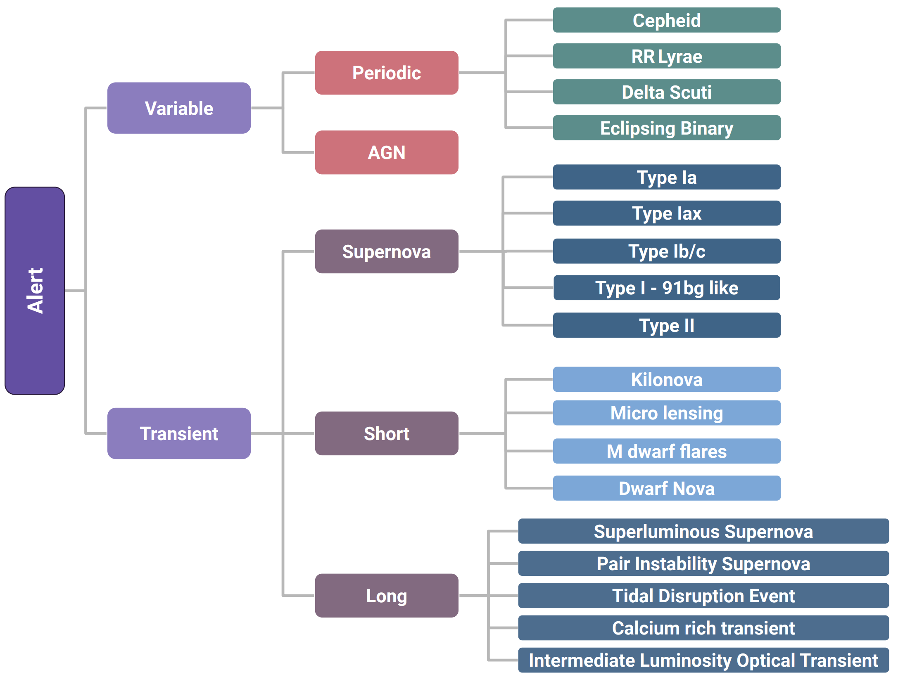
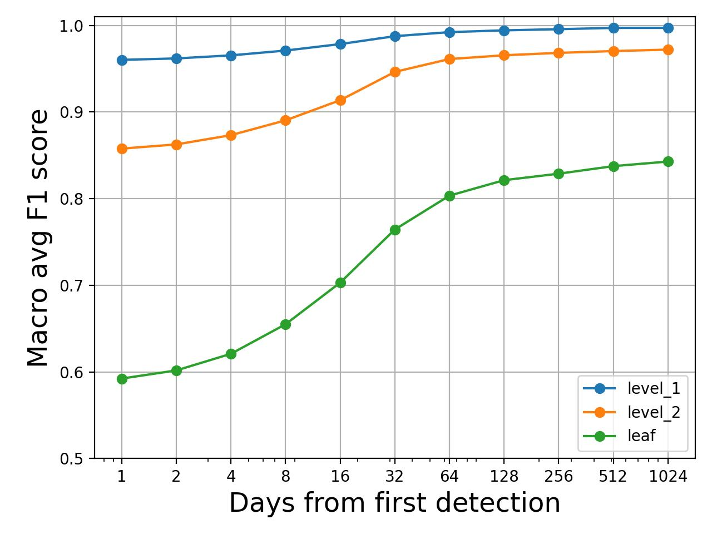

# ORACLE

[](https://arxiv.org/abs/2501.01496) [](https://ui.adsabs.harvard.edu/abs/2025arXiv250101496S/abstract) [](https://zenodo.org/records/15099699)
 


<p align="center">
  
</p>

We present ORACLE, the first hierarchical deep-learning model for real-time, context-aware classification of transient and variable astrophysical phenomena. ORACLE is a recurrent neural network with Gated Recurrent Units (GRUs), and has been trained using a custom hierarchical cross-entropy loss function to provide high-confidence classifications along an observationally-driven taxonomy with as little as a single photometric observation. Contextual information for each object, including host galaxy photometric redshift, offset, ellipticity and brightness, is concatenated to the light curve embedding and used to make a final prediction.

For more information, please read the our paper - https://ui.adsabs.harvard.edu/abs/2025arXiv250101496S/abstract

If you use any of this code in your own work, please cite the associated paper and software using the following 

```
@ARTICLE{oracle1,
       author = {{Shah}, Ved G. and {Gagliano}, Alex and {Malanchev}, Konstantin and {Narayan}, Gautham and {The LSST Dark Energy Science Collaboration}},
        title = "{ORACLE: A Real-Time, Hierarchical, Deep-Learning Photometric Classifier for the LSST}",
      journal = {arXiv e-prints},
     keywords = {Astrophysics - Instrumentation and Methods for Astrophysics, Astrophysics - High Energy Astrophysical Phenomena, Computer Science - Artificial Intelligence, Computer Science - Machine Learning},
         year = 2025,
        month = jan,
          eid = {arXiv:2501.01496},
        pages = {arXiv:2501.01496},
          doi = {10.48550/arXiv.2501.01496},
archivePrefix = {arXiv},
       eprint = {2501.01496},
 primaryClass = {astro-ph.IM},
       adsurl = {https://ui.adsabs.harvard.edu/abs/2025arXiv250101496S},
      adsnote = {Provided by the SAO/NASA Astrophysics Data System}
}

@software{oracle1-software,
  author       = {Shah, Ved and
                  Gagliano, Alexander and
                  Malanchev, Konstantin and
                  Narayan, Gautham and
                  Malz, A.I. and
                  The LSST Dark Energy Science Collaboration},
  title        = {ORACLE: A Real-Time, Hierarchical, Deep-Learning
                   Photometric Classifier for the LSST
                  },
  month        = mar,
  year         = 2025,
  publisher    = {Zenodo},
  doi          = {10.5281/zenodo.15099699},
  url          = {https://doi.org/10.5281/zenodo.15099699},
  swhid        = {swh:1:dir:731eb324342ca22b473e5ff6710483c721d417aa
                   ;origin=https://doi.org/10.5281/zenodo.15099698;vi
                   sit=swh:1:snp:8fc4b2c5a108b4542b5133dcfcd1dc2d7087
                   2fca;anchor=swh:1:rel:4aa4f29a46142866d1d3d0182950
                   4631c8b02696;path=ELAsTiCC-Classification-main
                  },
}
```

# Installation:

Oracle is a pip installable package and was developed on `python 3.10.16`. I recommend creating a new environment for every project. If you are using conda, you can do this using

`conda create -n <ENV_NAME> python=3.10`

Next, you can install oracle using

`pip install git+https://github.com/uiucsn/Astro-ORACLE.git`

This should set up oracle and related dependencies.

# Usage

If you only care about using ORACLE to classify your own light curves, please check `notebooks/tutorial.ipynb` for an example. 

Once the package has been installed, large parts of the functionality is exposed to the user through CLI commands. Specifically:

* oracle-train - Can be used to train new models
* oracle-test - Can be used to test the models
* oracle-runAnalysis - Can be used to generate summaries of the models performance
* oracle-classSummaries = Can be used to summarize the training/testing data sets
* oracle-combineParquet - Can be used to combine parquet files of different classes
* oracle-fitsToParquet - Can be used to convert the SNANA fits to parquet files
* oracle-prepArrays - Can be used to prepare the array for training/testing the models
* oracle-timeBenchmark - Can be used to benchmark the inference performance of ORACLE

# General file descriptions:

* fits_to_parquet.py - Convert SNANA fits files to parquet files
* combine_parquet.py - Combine the parquet files into a training and testing set.
* prep_array.py - Convert the test/train parquet files into pickle objects that can be ingested directly.
* LSST_Source.py - Class for storing relevant data from the parquet files. Has additional functionality for data augmentation, flux curve plotting etc.
* RNN_model.py - Class for the RNN classifier 
* train_RNN.py - Script for training the RNN classifier
* test_RNN.py - Script for testing the RNN classifier
* class_summaries.py - Summarize the number of objects in each class and the length of the TS data for each of those objects
* dataloader.py - Convert the parquet rows to tensors. Augment the data with padding/truncation and transforms if necessary
* loss.py - Loss function for hierarchical classification
* taxonomy.py - Utility functions for the taxonomy used for this work

## Convert the data to a more usable form:

The ELAsTiCC 2 training data set contains 32 different classes of astrophysical objects. Each object has 80 FITS files - 40 which contain the photometry and the remaining contain other information like the host galaxy properties. 

We care about having all the information (i.e. light curves + host galaxy) information for each object in a convenient format before we start any data augmentation. For this reason, we bind the HEAD and PHOT FITS files, extract the relevant information and store it as parquets. 

The code used for this conversion is in `fits_to_parquet.py`. This code is modified from an earlier version written by Kostya [here](https://github.com/hombit/yad).

### Convert Elasticc 2 train dataset

- Download the data with [this link](https://portal.nersc.gov/cfs/lsst/DESC_TD_PUBLIC/ELASTICC/ELASTICC2_TRAINING_SAMPLE_2/ELASTICC2_TRAIN_02.tar.bz2)
- Unpack it to `data/data/elasticc2_train/raw`
- `cd data/data/elasticc2_train`
- Convert all the data to parquet: `ls raw | sed 's/ELASTICC2_TRAIN_02_//' | xargs -IXXX -P32 python3 ../../../fits_to_parquet.py raw/ELASTICC2_TRAIN_02_XXX parquet/XXX.parquet`
- Next, we combine the per class parquet files into a train parquet file and a test parquet file. 
- Finally, we convert these to arrays which we pickle and ingest into the classifier.

You can find much more detailed information about the whole process in the paper(linked above).

# Classification Taxonomy

There is no universally correct classification taxonomy - however we want to build something that is able to best serve real world science cases. For obvious reasons, the leaf nodes need to be the true class of the object however what we decide for nodes higher up in the taxonomy is ultimately determined by the science case. 

For this work, we are implementing a hierarchy that will be of interest to the TVS (Transient and Variable star) community since it overlaps well with the classes of the elasticc data set. The exact taxonomy used is shown below:



A trap we wanted to avoid was mixing different "metaphors" for classification. For instance, we decided against using `Galactic vs Extra galactic` classification since we would be mixing a spatial distinction with temporal ones (like `Periodic vs Non periodic`). This makes the problem trickier since some objects, like Cepheids, can be both galactic and extragalactic which would result in an artificial inflation in the number of leaf nodes without adding much value to the science case.

*Note:* There is some inconsistency around the Mira/LPV object in the elasticc documentation however we have confirmed that this object was removed for the elasticc2 data set that we use in this work.

# Machine learning architecture


Once again, we have much more detailed discussion in the paper.

# Loss function

The loss function defines what the machine learning model(s) are incentivized to learn. In our case, we want the activations in our final layer to represent some (pseudo) probabilities for the classes in our taxonomy. The first loss function that we experiment with is the [Villar et al.](https://arxiv.org/abs/2312.02266v1) `Hierarchical Cross-entropy Loss for Classification`. The paper related to this loss function is available on [arXiv](https://arxiv.org/abs/2312.02266v1). 

# Found Bugs?
We would appreciate any support in the form of bug reports in order to provide the best possible experience. Bugs can be reported in the `Issues` tab.

# Contributing
If you like what we're doing and want to contribute to the project, please start by reaching out to the developer. We are happy to accept suggestions in the Issues tab. 

# Some cool results:

Overall model performance:



First at the root,


At the next level in the hierarchy


And finally, at the leaf...


